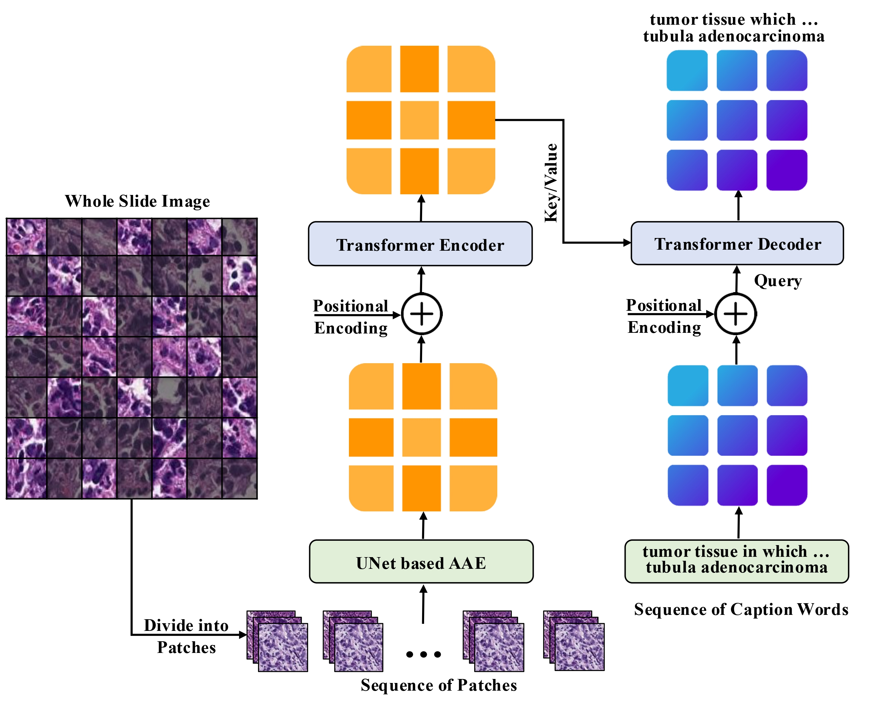
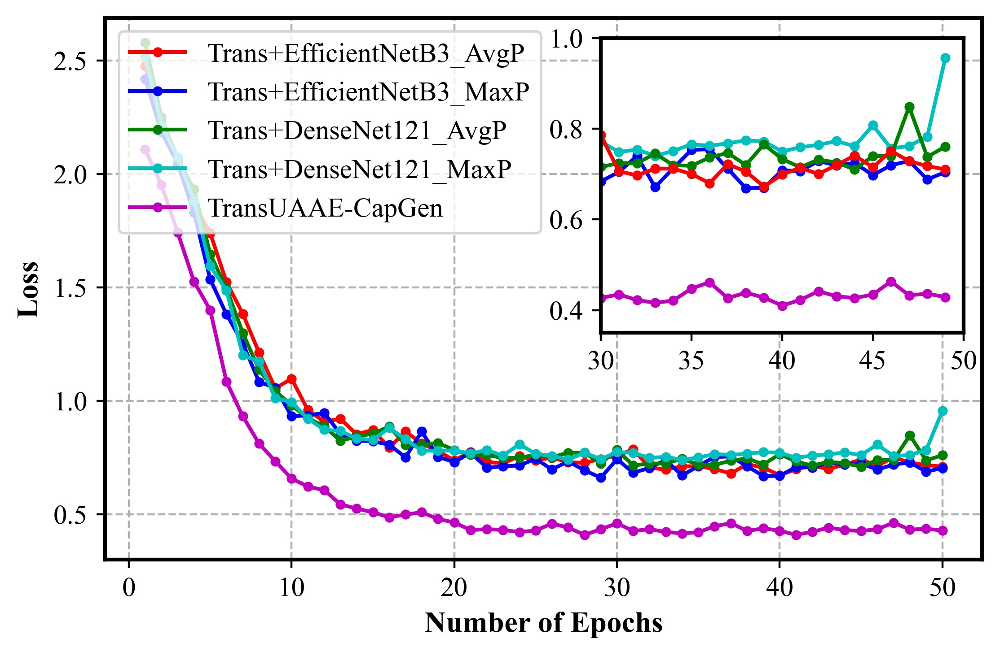

# TransUAAE-CapGen: Caption Generation from Histopathological Patches through Transformer and UNet-Based Adversarial Autoencoder

## Abstract

Captioning Whole Slide Images (WSIs) for pathological analysis is an essential but not extensively explored aspect of computer-aided pathological diagnosis. Challenges arise from insufficient datasets and the effectiveness of model training. Generating automatic caption reports for various gastric adenocarcinoma images is another challenge. In this paper, we introduce a hybrid method referred to as TransUAAE-CapGen to generate histopathological captions from WSI patches. The TransUAAE-CapGen architecture consists of a hybrid UNet-based Advereasrial Autoencoder (AAE) for feature extraction and a transformer for caption generation. The hybrid UNet-based AAE extracted complex tissue properties from histopathological patches, transforming them into low-dimensional embeddings. The embeddings are then fed into the transformer to generate concise captions. Our proposed method is validated using the PatchGastricADC22 dataset. The TransUAAE-CapGen model provides the best estimated accuracy of  BLEU-4 = 86.8%, METEOR = 59.6%, a ROUGE = 89.3%, and CIDEr = 7.72%. Experimental analysis indicates that the TransUAAE-CapGen architecture outperforms the traditional LSTM-based model for the caption generation task. Our findings reveal that the proposed architecture can effectively generate accurate and precise reports for medical image analysis.

    
    
<em>Figure 1: Architecture of our proposed TransUAAE-CapGen  model for histopathological caption generation.</em>

## Results

  <table>
    <tr>
      <td>
        
        
(a) Training Loss

      </td>
      <td>
        
        
(b) Validation Loss

      </td>
    </tr>
  </table>
  
<em>Figure 2: Loss curve representation on the PatchGastricADC22 dataset using the proposed TransUAAE-CapGen model along with four baseline architectures. (a) Training loss (b) Validation loss.</em>

## Contact
S M Taslim Uddin Raju || Research Postgraduate (MASc.)  
Department of Electrical and Computer Engineering || University of Waterloo (UW)  
200 University Ave W, Waterloo, ON N2L 3G1, Canada 
E-mail: [smturaju@uwaterloo.ca](mailto:smturaju@uwaterloo.ca) || [taslimuddinraju7864@gmail.com](mailto:taslimuddinraju7864@gmail.com)   
[Google Scholar](https://scholar.google.ca/citations?user=ToadRS8AAAAJ&hl=en) || [LinkedIn](https://www.linkedin.com/in/raju32742/)
